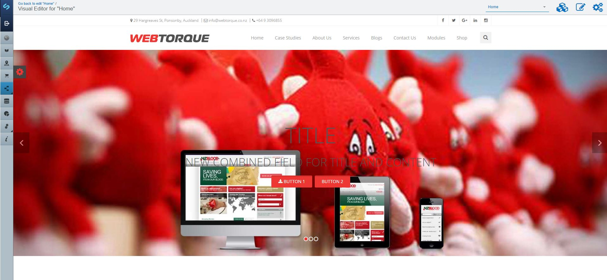
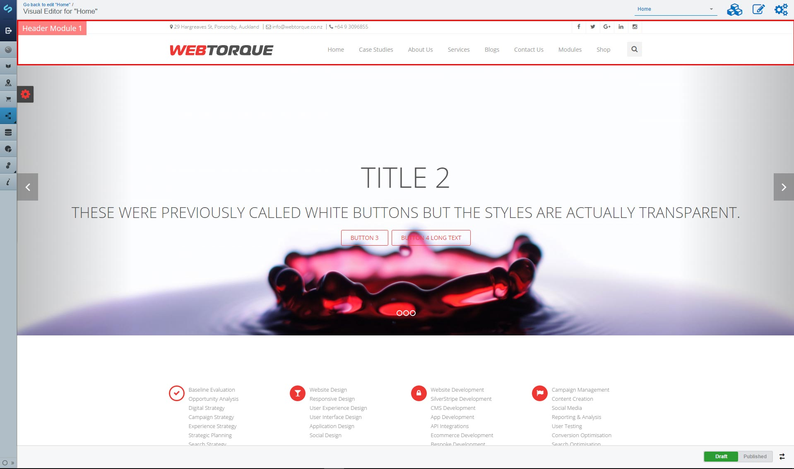
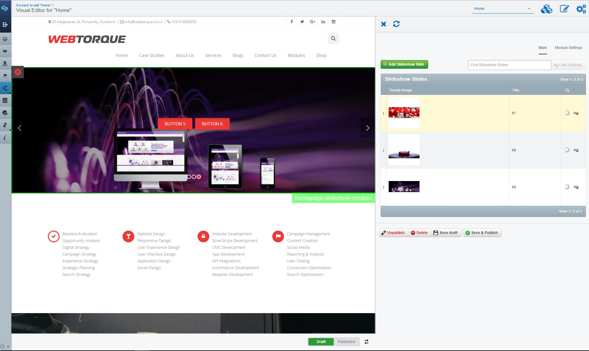
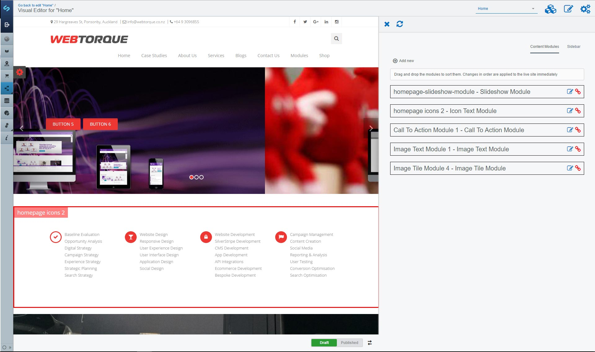

# In Page Content Modules

Alternative method to define content in the CMS, either replacing or amending
SilverStripe's core "page type" system. Allows authors to insert "content modules"
into a page as separate items, which enables more flexible content structures
both for sidebar-style content and flexible main content areas.

## Features

 * Define your own content modules by subclassing `ContentModule`
 * Sort modules via drag'n'drop
 * Save module drafts and publish independently of the parent page
 * List all used modules in a separate admin interface, and view their history
 * Reuse content modules on multiple pages by saving them to a library
 * Built-in modules: Text, Image (incl. cropping), related pages

## Screenshots


## Installation

Install the module into a `inpage-modules\` folder inside the webroot.

With composer - composer require webtorque7/inpage-modules

Then add the `ContentModule_PageExtension` class to either your base `Page` class or select subclasses.

```yml
# File: mysite/_config/config.yml
Page:
  extensions:
    - ContentModule_PageExtension
```

In your template (e.g. `themes/<yourtheme>/templates/Layout/Page.ss`) you can loop through
modules, and have them render with their own templates:

```html
<% loop $SortedContentModules %>
	$forTemplate
<% end_loop %>
```

## Templates

Create a template with same name as the module e.g. ImageModule.ss. Uses the same template
inheritance model as SiteTree objects to get the template. By convention it is a good idea to
add module templates to `themes/<yourtheme>/templates/modules`

## Multiple Sections

Multiple sections for modules can be added to a page creating a new base class e.g. SideBarModule
and setting up a many_many relationship

```php
$many_many = array(
    'SideBarModules' => 'SideBarModule'
);

$many_many_extraFields = array(
    'SideBarModules' => array(
        'Sort' => 'Int'
    )
);
```

Make sure to add the Sort field. To simplify getting the sorted modules you can overwrite the
many many function

```php
public function SideBarModules() {
    return $this->getManyManyComponents('SideBarModules')->sort('Sort');
}
```

## Visual Editor

A new feature is the visual editor. This adds the ability to edit modules while viewing the page. The editor is
presented with a preview and can click on a module to edit. This includes header and footer modules if it has been setup.






Access to this feature needs to be added manually. A simple way of doing this is by adding a button to the page form

```php
$fields->addFieldsToTab('Root.Main', array(
    LiteralField::create(
        'VisualEditorLink',
        sprintf(
            '<p><a href="%s" class="ss-ui-button .ss-ui-button-ajax visual-editor-button">Visual Editor</a></p>',
            Controller::join_links(singleton('VisualEditor')->Link('edit'), $this->ID)
        )
    )
));
```

To use header and footer modules you must enable it in the config

```yml
ContentModule:
  enable_global_modules: 1
```

Header modules shoule inherit from HeaderBaseModule, and footer modules should inherit from FooterBaseModule.
The default modules can be set in the site config (Settings) in CMS. The default modules can be disabled per page
in the Settings tab of the page.